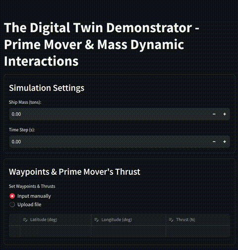

# Digital Twin Demonstrator - Prime Mover & Mass Dynamic Interactions



## Overview

The Digital Twin Demonstrator application allows users to simulate the dynamic interactions of a prime mover and a mass. It includes settings for ship mass, time steps, waypoints, thrust inputs, and resistance data.

## Features

- **Simulation Settings**: Configure the ship mass and time step.
- **Waypoints & Thrust Input**: Input waypoints and thrust values manually or upload from a CSV file.
- **Resistance (Drag) Force**: Upload a resistance (drag) force file to include hydrodynamic resistance in the simulation.
- **Simulation Execution**: Execute the simulation and visualize the results.

## Usage Instructions

### 1. Simulation Settings

1. Run the application (see **Requirements** below to set up).
2. Enter the ship mass (in tons) and the time step (in seconds).

### 2. Set Waypoints & Thrust

You can either input the waypoints and thrust values manually or upload them from a CSV file.

#### Input Manually

1. Select "Input manually."
2. Enter the latitude, longitude, and thrust (N) for each waypoint.

#### Upload CSV File

1. Select "Upload file."
2. Upload a CSV file containing the latitude, longitude, and thrust (N) values.

### 3. Set Resistance (Drag) Force

1. Upload a resistance file (CSV) containing speed and corresponding drag coefficient values.
2. The application will display the resistance data in a line chart.

### 4. Execute Simulation

1. Click the "Execute" button to run the simulation.
2. Ensure that mass, time step, and resistance data are provided before execution.

### 5. View Results

After executing the simulation, the results will be displayed in charts showing:

- Time Elapsed vs. Travel Distance
- Time Elapsed vs. Velocity

## Files Included

- **app.py**: The main application script.
- **map_util.py**: Utility functions for map visualization using PyDeck.
- **physics_engine.py**: Contains the physics engine and digital twin models for the simulation.

## Requirements

Ensure you have the following Python packages installed:

- `streamlit`
- `pandas`
- `numpy`
- `pydeck`
- `plotly`
- `geopy`
- `stqdm`

To install the required packages, you can use:

```sh
pip install streamlit pandas numpy pydeck plotly geopy stqdm
```

Running the Application
1. Ensure all required files are in the same directory.
2. Run the application using Streamlit:

```sh
streamlit run app.py
```
3. Open the provided local URL (e.g., http://localhost:8501) in your web browser to interact with the application, if not already opened automatically. 

## License & Authors

This project is licensed under the MIT License.  

Januwar Hadi & Dr Tay Zhi Yung  
Singapore Institute of Technology (SIT)
